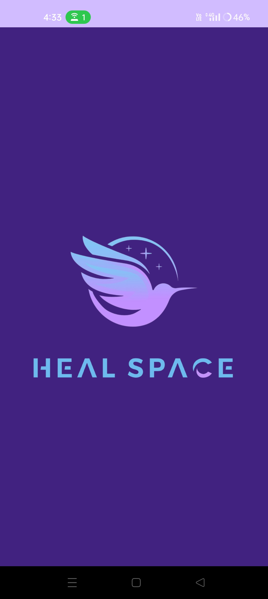

# 🌿 HealSpace – Your Pocket Mental Wellness Companion

Welcome to **HealSpace**, an Android-based mental wellness app designed to help you breathe, reflect, and recharge—right from your phone. Built with love, logic, and a whole lot of purple 💜, this all-in-one mental health space supports users with a **virtual AI therapist**, **mood journaling**, **guided meditations**, and more.

> ✨ Final Year Individual Project | Built with care, code & creativity | A+ Graded ✨

---

## 🧠 Features

### 🗨️ Virtual Therapist (AI Chatbot)
- Built using **Gemini 2.0 Flash API**
- Offers thoughtful replies for stress relief & reflection
- *Does not store user data – totally safe & private*

### ✍️ Mood Tracker + Journal
- Select a mood (e.g., Joy, Sad, Angry) and jot down your feelings
- Notes are color-coded based on mood 🌈
- All entries stored locally & viewable in a separate **Mood Journal**

### 🧘 Guided Meditations
- Includes audio guides for:
  - Timed Meditation
  - Anxiety Relief
  - and more...
- Designed to calm your mind & ground your emotions

### 💬 Inspiring Quotes
- Get a **random motivational quote** each time the home screen is opened or refreshed 💡

### 👤 Custom Profile
- Choose from multiple avatar options
- Log out securely anytime
- Clean, purple-themed UI designed from scratch

---

## 📸 Preview

  
  
  
  
  
  
  
  
  
  
  

---

## 📲 APK Download

> ⚠️ **Disclaimer**: This app uses **SharedPreferences** for local storage. While it ensures smooth performance, saved data may be cleared when the app is uninstalled or on some device resets. Future versions may integrate cloud sync for better persistence.

👉 [**Download APK**](https://github.com/divya-dev24/HealSpace/releases/download/v1.0.0/app-debug.apk)

---

## 🛠️ Built With

| Tech/Tool            | Purpose                         |
|----------------------|----------------------------------|
| **Kotlin**           | Core logic & app functionality  |
| **XML**              | Custom UI design & layout       |
| **Android Studio**   | Main IDE for development        |
| **Firebase Auth**    | User authentication (login/signup) |
| **Gemini API**       | Powering the AI chatbot         |
| **SharedPreferences**| Local storage for mood notes & user state |
| **AI Design Tools**  | Logo, splash animation & assets |
| **Git & GitHub**     | Version control & project hosting |

> 🔧 All UI/UX, structure, and design patterns were manually crafted with full control over layout and flow.

---

## 💡 Highlights

- ✅ Solo-developed project from ideation to deployment
- ✅ UI/UX designed entirely from scratch (with a consistent purple aesthetic)
- ✅ Integrated multiple AI tools for both design & logic help
- ✅ Completed within a month & graded **A+** ⭐
- ✅ Focused on *daily usage, mental clarity, and emotional awareness*

---

## 🚀 How to Use

1. **Install the APK** and launch the app
2. Swipe through beautiful onboarding screens
3. Sign up or log in using your email
4. Start chatting with your AI therapist, track your moods, meditate, or just chill with daily quotes!

---

## 🤝 Contributing

This project was developed as a final year individual submission and is currently not accepting external contributions.

---

## 💌 Credits

Developed with 💜 by Divya .R

From logic to layout, bugs to beauty—crafted with patience, persistence, and purple.

Special thanks to:
- AI tools that helped bridge ideas into code
- YouTube devs & docs for guiding tricky integrations
- And a sprinkle of late-night debugging magic ✨

---

